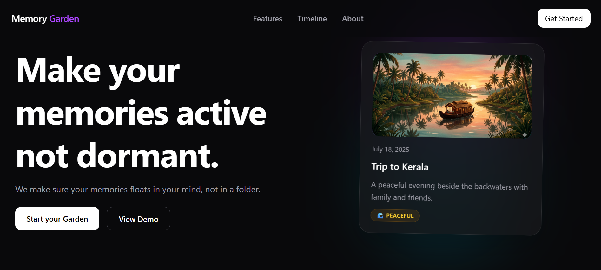
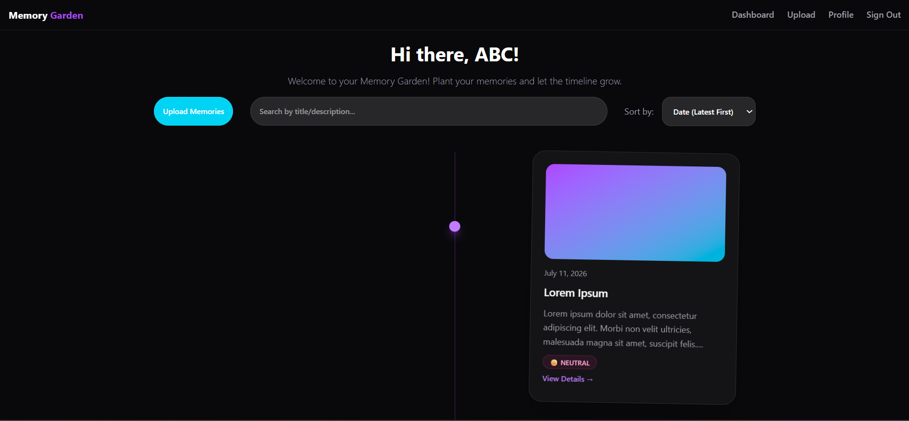
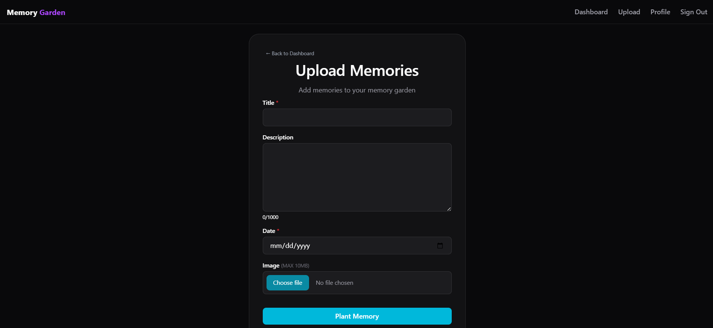
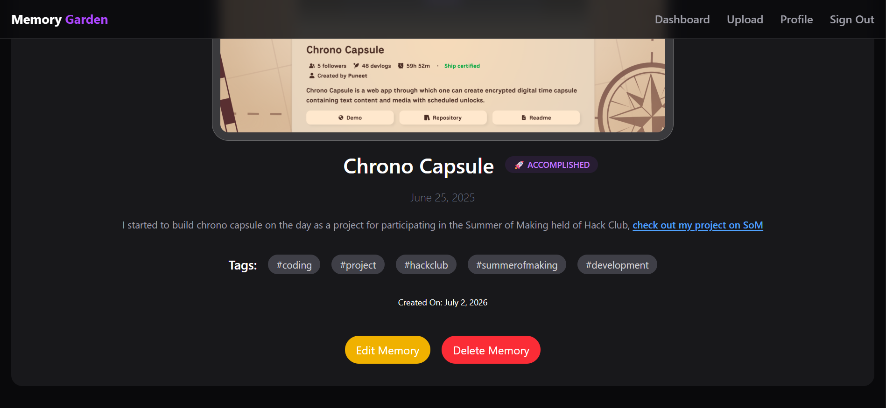
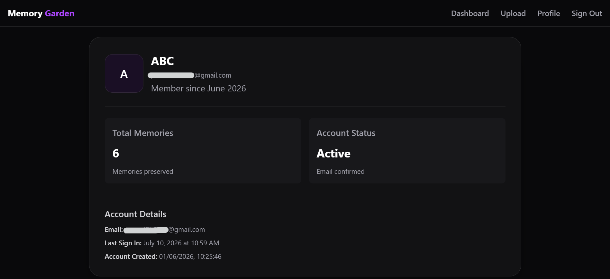

# Memory Garden

Memory Garden is an web application where you can store your memories and make them feel real inside of they sitting dormant inside a folder. Memory Garden also uses AI to generate insights. Check the live running application at [https://memory.puneetg.me](https://memory.puneetg.me).

## Features

- Securely authenticate using Supabase Auth
- Upload images with Supabase Storage
- Visualize timeline interactively
- Generate insights using AI
- Support markdown for memory descriptions in detailed memory page
- Organize memories chronologically or by title
- Store memories in private capsules *(UPCOMING)*

## Screenshots

### Landing Page



### Dashboard



### Upload Memory



### Memory Details



### Profile



## Tech Stack

- React (with Vite)
- Supabase
    - Authentication
    - PostgreSQL Database
    - Storage
    - Edge Functions
- Tailwind CSS
- Google Gemini API

## Getting Started

This is a guide to self host the web application on your own server.

### Prerequisites

- Node.js (v22.22 or later)
- npm (v10 or later)
- [Supabase](https://supabase.com) project
- Google AIStudio API Key for Gemini API

### Installation

```bash
git clone https://github.com/PuneetGopinath/memory-garden.git
cd memory-garden
npm install
```

### Configuration

Copy the `.env.example` file to `.env` and fill in the required environment variables.
The project contains separate environment files for `src` and `supabase`.

### Running the Web Application

- To run it in development mode:
    ```bash
    npm run dev
    ```

- To build and run the production version:
    ```bash
    npm run build
    npm run preview
    ```

## Roadmap

### v0.4.0

- Search by tags
- Filter by tags
- AI Summaries for sum of memories

### Future

- Private Capsules
- Memory sharing
- Import/Export memories
- Mobile-friendly design
- Upload video and audio in a memory
- Support for multiple images per memory
- Image Editing after upload
- Calendar view

## License

This project is licensed under the MIT License. Read the [LICENSE](https://github.com/PuneetGopinath/memory-garden/blob/main/LICENSE) file for details.

## Contributing

We welcome contributions! Do not hesitate to contribute even if you are a first-time contributor.
 
Please read the [contributing guidelines](https://github.com/PuneetGopinath/memory-garden/blob/main/CONTRIBUTING.md) before submitting a pull request.